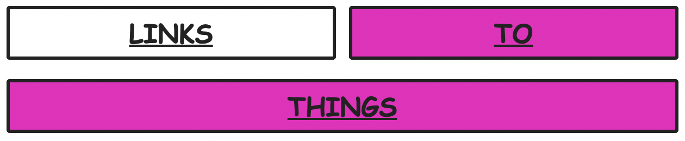

# Linkblocks

Linkblocks is a plugin for Obsidian that lets you create big link buttons out of simple code blocks.

## Example

This code block:

```lblock
LINKS|https://links.com
TO|TWO

THINGS|$DATE(yyyy-MM-DD)
```

would create the following link block:



In this example, the "LINKS" button would open "https://links.com" in a web browser, "TO" would take you to a note named "TWO" in Obsidian, and "THINGS" would take you to a note with a title of today's date (in the format shown)

## Details

### Creating a link block

Simply create a codeblock with the `lblock` language identifier and add some links

### Adding links

Add links sequentially within the code block.

Links should follow the structure `<TITLE>|<VALUE>`

Add an empty line to put the following link(s) on a new line.

The following types of links are available:

- URL: If the value begins with `http:` or `https:`, it will be opened in a web browser
- Date: If the value is of the form `$DATE(<momentjs format>)`, then it will be formatted using the current date and interpretted as a regular note title
- Note: If none of the above types are matched, it will be interpretted as a regular note title

### Styling

Colors will be selected randomly seeded with a hash of the notes title -- This means that they will be random for a given note, but will remain constant as long as the title does

Further styles may be added with CSS by applying them to the `.block` class.